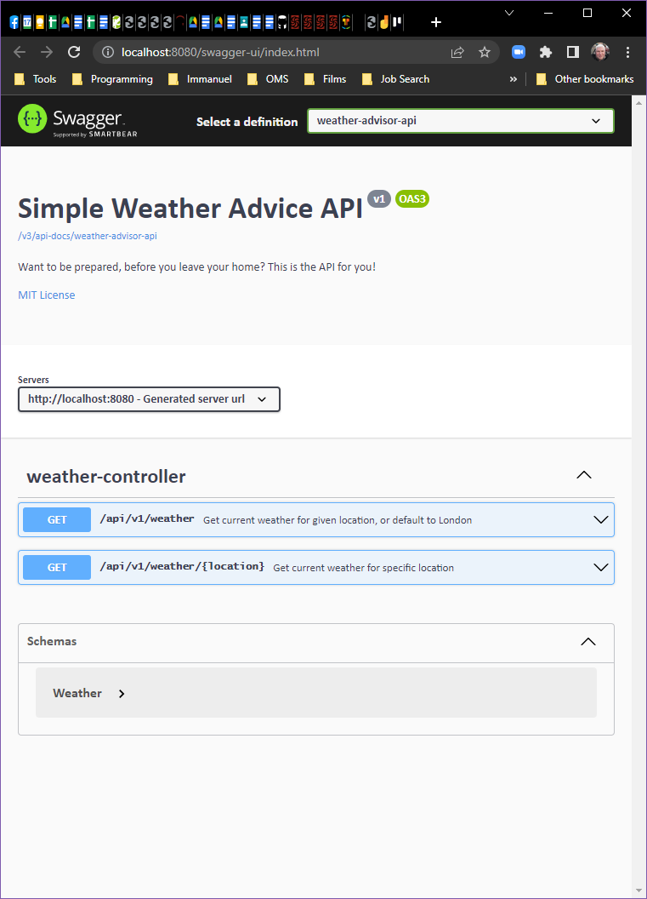

# Containerising the API using Docker

If you have already installed Docker, 
then you can skip to the [Starting the Docker Daemon](#starting-the-docker-daemon).

## Installation of Docker

As my laptop (Windows 10 Home Edition) does not support containers and Hyper-V, 
I had to find another way of getting Docker onto my PC.  
This required running two Linux containers under WSL 2.
This is what I should have done, rather than going round the houses.
Hopefully it is complete and nothing is missing.

On an elevated PowerShell:
* `wsl --install` if not already installed (if it is you get the help screen!)
* `wsl --set-default-version 2` to make WSL 2 the default
* `wsl --list --online` to see what distros are available
* `wsl --install -d Ubuntu` - I used Ubuntu

As part of the installation, 
a new Linux terminal will open in which you will be prompted to create a user and password for your Linux.
This does not have to match any user you have anywhere else.

In the new Linux terminal, so set up and installation:
* `sudo apt update` make sure the distros are up-to-date
* `sudo apt upgrade` make sure the Linux is up-to-date - probably requires a restart of the terminal / image
* Some magic stuff to set up for installing Docker:
  * `sudo apt-get install ca-certificates curl gnupg lsb-release`
  * `curl -fsSL https://download.docker.com/linux/ubuntu/gpg | sudo gpg --dearmor -o /usr/share/keyrings/docker-archive-keyring.gpg`
  * `echo   "deb [arch=$(dpkg --print-architecture) signed-by=/usr/share/keyrings/docker-archive-keyring.gpg] https://download.docker.com/linux/ubuntu $(lsb_release -cs) stable" | sudo tee /etc/apt/sources.list.d/docker.list > /dev/null`
  * `sudo apt-get update`
  * `sudo apt-get install docker-ce docker-ce-cli containerd.io docker-compose-plugin`
* `sudo docker images` to check you are installed and as this is new there won't be any:
* `REPOSITORY            TAG                 IMAGE ID       CREATED          SIZE`
* There is no docker daemon running, start the daemon

## Starting the Docker Daemon

In a Linux container terminal:
* `sudo dockerd` this will write log messages to the terminal

The last messages should be something like:
```
INFO[2022-05-17T08:52:01.919387500+01:00] Daemon has completed initialization
INFO[2022-05-17T08:52:01.950423200+01:00] API listen on /var/run/docker.sock
```
Leave this running and do the rest on another terminal.

## Build the Maven package in the IntelliJ

On the Maven tab (left - top of the IDE) select:
* weather-advisor
  * Lifecycle
    * package - right-click:
      * Run Maven Build

## Packaging

Start a new Linux terminal (not the daemon one) and enter the commands:
```
$ sudo docker build -t weather-advisor-api:1.0 .
```
If the daemon is not running you will get:
```
Cannot connect to the Docker daemon at unix:///var/run/docker.sock. Is the docker daemon running?
```
If all is good you will get something like:
```Sending build context to Docker daemon  24.38MB
Step 1/7 : FROM amazoncorretto:17-alpine3.14-jdk
17-alpine3.14-jdk: Pulling from library/amazoncorretto
8663204ce13b: Pull complete
790b2e44330f: Pull complete
Digest: sha256:377c541c6e9e768cd7088c63890e4496fcf1f1618423c79b13088c827d8a256a
Status: Downloaded newer image for amazoncorretto:17-alpine3.14-jdk
---> 02eb1096abef
Step 2/7 : RUN addgroup -S spring && adduser -S spring -G spring
---> Running in 4b0a55a18ab3
Removing intermediate container 4b0a55a18ab3
---> b2a8d5f31be4
Step 3/7 : USER spring:spring
---> Running in 969876b1e550
Removing intermediate container 969876b1e550
---> 8d61fa88e316
Step 4/7 : ARG JAR_FILE=target/*.jar
---> Running in 15c83d8be6d1
Removing intermediate container 15c83d8be6d1
---> 33987d9cc2fd
Step 5/7 : COPY ${JAR_FILE} app.jar
---> 4898bf1feae1
Step 6/7 : EXPOSE 8080
---> Running in d7889fccf180
Removing intermediate container d7889fccf180
---> 0622d60651cb
Step 7/7 : ENTRYPOINT ["java","-jar","/app.jar"]
---> Running in f3c0c7f8ae22
Removing intermediate container f3c0c7f8ae22
---> f8cc2a02c262
Successfully built f8cc2a02c262
Successfully tagged weather-advisor-api:1.0
```
Get images to check:
```
$ sudo docker images
REPOSITORY            TAG                 IMAGE ID       CREATED          SIZE
weather-advisor-api   1.0                 f8cc2a02c262   24 seconds ago   357MB
amazoncorretto        17-alpine3.14-jdk   02eb1096abef   3 weeks ago      333MB
hello-world           latest              feb5d9fea6a5   7 months ago     13.3kB
```

## Running in a container

```
$ sudo docker run -p 8080:8080 weather-advisor-api:1.0

  .   ____          _            __ _ _
 /\\ / ___'_ __ _ _(_)_ __  __ _ \ \ \ \
( ( )\___ | '_ | '_| | '_ \/ _` | \ \ \ \
 \\/  ___)| |_)| | | | | || (_| |  ) ) ) )
  '  |____| .__|_| |_|_| |_\__, | / / / /
 =========|_|==============|___/=/_/_/_/
 :: Spring Boot ::                (v2.6.7)

2022-05-17 06:55:59.561  INFO 1 --- [           main] c.t.m.w.WeatherAdvisorApplication        : Starting WeatherAdvisorApplication v0.0.1-SNAPSHOT using Java 17.0.3 on b952ce43364e with PID 1 (/app.jar started by spring in /)
2022-05-17 06:55:59.572  INFO 1 --- [           main] c.t.m.w.WeatherAdvisorApplication        : No active profile set, falling back to 1 default profile: "default"
2022-05-17 06:56:02.470  INFO 1 --- [           main] o.s.b.w.embedded.tomcat.TomcatWebServer  : Tomcat initialized with port(s): 8080 (http)
2022-05-17 06:56:02.502  INFO 1 --- [           main] o.apache.catalina.core.StandardService   : Starting service [Tomcat]
2022-05-17 06:56:02.505  INFO 1 --- [           main] org.apache.catalina.core.StandardEngine  : Starting Servlet engine: [Apache Tomcat/9.0.62]
2022-05-17 06:56:02.726  INFO 1 --- [           main] o.a.c.c.C.[Tomcat].[localhost].[/]       : Initializing Spring embedded WebApplicationContext
2022-05-17 06:56:02.726  INFO 1 --- [           main] w.s.c.ServletWebServerApplicationContext : Root WebApplicationContext: initialization completed in 2940 ms
2022-05-17 06:56:04.904  INFO 1 --- [           main] o.s.b.w.embedded.tomcat.TomcatWebServer  : Tomcat started on port(s): 8080 (http) with context path ''
2022-05-17 06:56:04.936  INFO 1 --- [           main] c.t.m.w.WeatherAdvisorApplication        : Started WeatherAdvisorApplication in 6.506 seconds (JVM running for 7.392)
```

If this fails, then it is probably because we don't have the environment variable set up.
Temporarily set the `openapi.key` in the [application.properties file](../src/main/resources/application.properties).
Then go back to IntelliJ and [package](#build-the-maven-package-in-the-intellij) again, 
[package in docker](#packaging) and then [run in the container](#running-in-a-container) ...

## Accessing the containerised API:

Using: http://localhost:8080/api/v1/weather
```
// 20220517075809
// http://localhost:8080/api/v1/weather

{
  "locationName": "London",
  "countryCode": "GB",
  "lat": 51.5099,
  "lon": -0.1181,
  "temp": 15.57,
  "rain": 0.0,
  "cloud": 66
}
```
Accessing API Documentation with: http://localhost:8080/swagger-ui/index.html
``` html

<!-- HTML for static distribution bundle build -->
<!DOCTYPE html>
<html lang="en">
  <head>
    <meta charset="UTF-8">
    <title>Swagger UI</title>
    <link rel="stylesheet" type="text/css" href="./swagger-ui.css" />
    <link rel="stylesheet" type="text/css" href="index.css" />
    <link rel="icon" type="image/png" href="./favicon-32x32.png" sizes="32x32" />
    <link rel="icon" type="image/png" href="./favicon-16x16.png" sizes="16x16" />
  </head>

  <body>
    <div id="swagger-ui"></div>
    <script src="./swagger-ui-bundle.js" charset="UTF-8"> </script>
    <script src="./swagger-ui-standalone-preset.js" charset="UTF-8"> </script>
    <script src="./swagger-initializer.js" charset="UTF-8"> </script>
  </body>
</html>
```
As an image:



And as machine-readable:
```
// 20220517081036
// http://localhost:8080/v3/api-docs/weather-advisor-api

{
  "openapi": "3.0.1",
  "info": {
    "title": "Simple Weather Advice API",
    "description": "Want to be prepared, before you leave your home? This is the API for you!",
    "license": {
      "name": "MIT License",
      "url": "http://springdoc.org"
    },
    "version": "v1"
  },
  "servers": [
    {
      "url": "http://localhost:8080",
      "description": "Generated server url"
    }
  ],
  "paths": {
    "/api/v1/weather": {
      "get": {
        "tags": [
          "weather-controller"
        ],
        "summary": "Get current weather for given location, or default to London",
        "operationId": "getWeather",
        "parameters": [
          {
            "name": "lat",
            "in": "query",
            "required": false,
            "schema": {
              "type": "number",
              "format": "double",
              "default": 51.5072
            }
          },
          {
            "name": "lon",
            "in": "query",
            "required": false,
            "schema": {
              "type": "number",
              "format": "double",
              "default": -0.1276
            }
          }
        ],
        "responses": {
          "200": {
            "description": "OK",
            "content": {
              "*/*": {
                "schema": {
                  "$ref": "#/components/schemas/Weather"
                }
              }
            }
          }
        }
      }
    },
    "/api/v1/weather/{location}": {
      "get": {
        "tags": [
          "weather-controller"
        ],
        "summary": "Get current weather for specific location",
        "operationId": "getWeather_1",
        "parameters": [
          {
            "name": "location",
            "in": "path",
            "description": "location to get weather for",
            "required": true,
            "schema": {
              "type": "string"
            },
            "example": "London"
          }
        ],
        "responses": {
          "200": {
            "description": "OK",
            "content": {
              "*/*": {
                "schema": {
                  "$ref": "#/components/schemas/Weather"
                }
              }
            }
          }
        }
      }
    }
  },
  "components": {
    "schemas": {
      "Weather": {
        "type": "object",
        "properties": {
          "locationName": {
            "type": "string",
            "description": "Location name of the given weather"
          },
          "countryCode": {
            "type": "string",
            "description": "Country code of the given weather location"
          },
          "lat": {
            "type": "number",
            "description": "Latitude of given weather location",
            "format": "double"
          },
          "lon": {
            "type": "number",
            "description": "Longitude of given weather location",
            "format": "double"
          },
          "temp": {
            "type": "number",
            "description": "Current temperature in degrees C",
            "format": "double"
          },
          "rain": {
            "type": "number",
            "description": "Rainfall in last hour in mm",
            "format": "double"
          },
          "cloud": {
            "type": "integer",
            "description": "Current cloud cover as %",
            "format": "int32"
          }
        },
        "description": "Encapsulation of the current weather"
      }
    }
  }
}
```